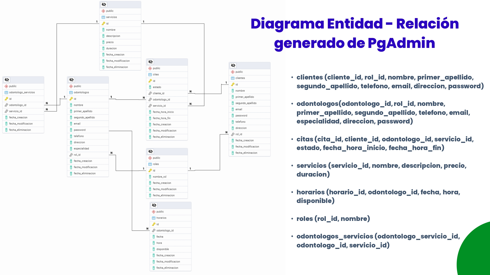
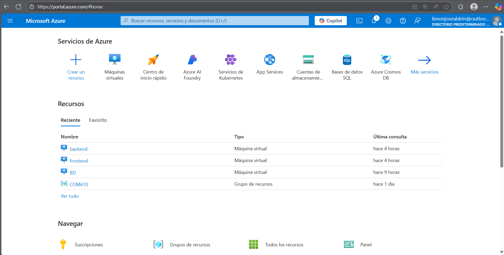
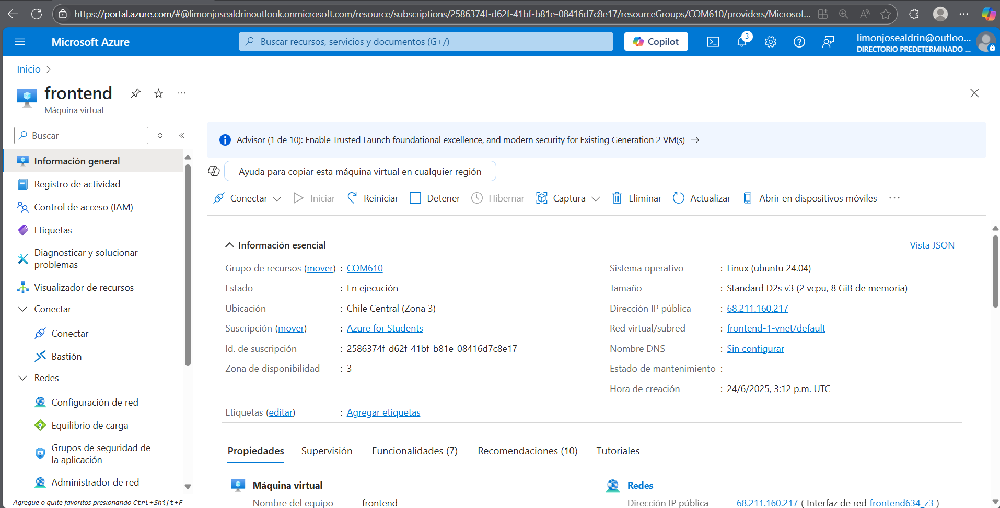
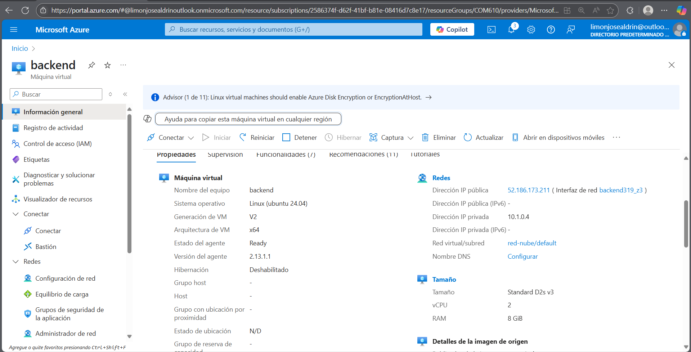
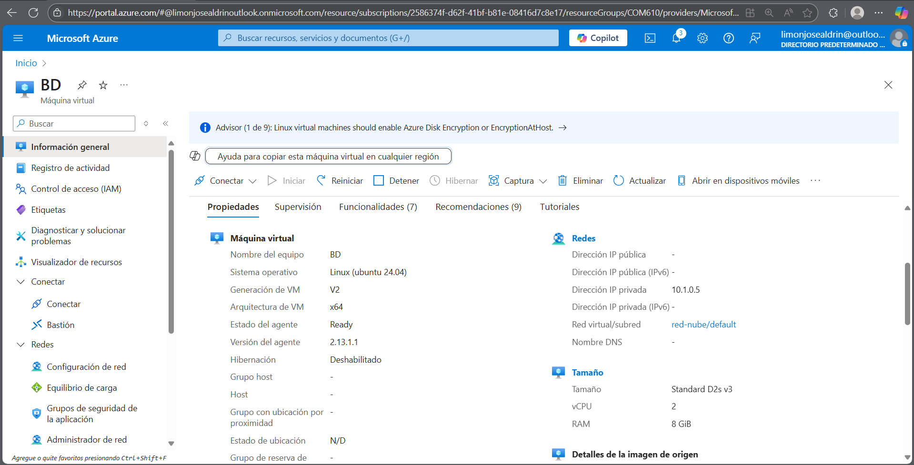
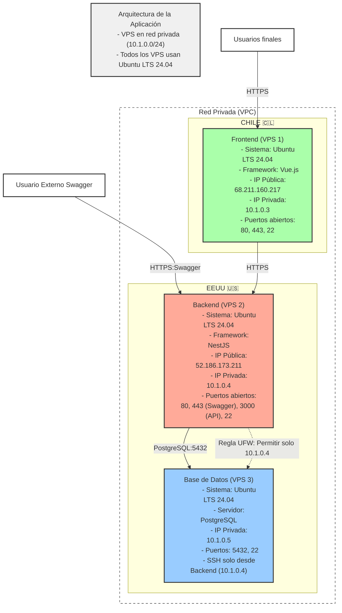

# 🎯 Proyecto Final: Despliegue de Aplicaciones Multi-Capa en Tres Instancias VPS en la Nube   

## 📋 Índice

- [Descripción del proyecto y funcionalidad de la aplicación](#descripción-del-proyecto-y-funcionalidad-de-la-aplicación)
- [Diagrama de la arquitectura de la solución](#diagrama-de-la-arquitectura-de-la-solución)
- [Instrucciones](#instrucciones)
  - [Creación de instancia](#creación-de-instancia)
  - [Comandos SSH](#comandos-ssh)
  - [IPs públicas de las instancias](#ips-públicas-de-las-instancias)
- [Nombres de los integrantes](#nombres-de-los-integrantes)

---

## Descripción del proyecto y funcionalidad de la aplicación

---

## Diagrama de la arquitectura de la solución

## Instrucciones

### Creación de instancia

### Comandos SSH

#### Pasos para el despliegue del frontend

| Paso | Acción                                | Comando                                                                                                                                                                                                                                                                                                                                                                                                                                                                                                                                                                                                                                                         | Descripción                                                                                                                          |
| ---- | ------------------------------------- | --------------------------------------------------------------------------------------------------------------------------------------------------------------------------------------------------------------------------------------------------------------------------------------------------------------------------------------------------------------------------------------------------------------------------------------------------------------------------------------------------------------------------------------------------------------------------------------------------------------------------------------------------------------- | ------------------------------------------------------------------------------------------------------------------------------------ |
| 1    | Hacer build del proyecto              | `npm run build`                                                                                                                                                                                                                                                                                                                                                                                                                                                                                                                                                                                                                                                 | Genera la carpeta `dist/` con los archivos de producción de tu frontend Vue.js en el directorio de tu proyecto local.                |
| 2    | Conectarse por SSH a la instancia     | `ssh -i /ruta/a/LightsailDefaultKey-us-east-1.pem ubuntu@IP_PUBLICA` `ssh -i D:\aws\frontend.pem ubuntu@34.212.6.62`                                                                                                                                                                                                                                                                                                                                                                                                                                                                                                                                         | Conecta al servidor usando la clave PEM de Lightsail y la IP pública de la instancia.                                                |
| 3    | Actualizar paquetes del sistema       | `sudo apt update && sudo apt upgrade -y`                                                                                                                                                                                                                                                                                                                                                                                                                                                                                                                                                                                                                        | Actualiza la lista de paquetes e instala las últimas versiones para mantener el sistema seguro.                                      |
| 4    | Instalar Node.js y npm                | `sudo apt install -y nodejs npm` OPCIONAL                                                                                                                                                                                                                                                                                                                                                                                                                                                                                                                                                                                                                       | Instala Node.js y npm para gestionar dependencias si necesitas instalar algo adicional en el servidor.                               |
| 5    | Instalar Nginx                        | `sudo apt install -y nginx`                                                                                                                                                                                                                                                                                                                                                                                                                                                                                                                                                                                                                                     | Instala Nginx como servidor web para servir los archivos estáticos de tu frontend.                                                   |
| 6    | Iniciar y habilitar Nginx             | `sudo systemctl start nginx`  `sudo systemctl enable nginx`                                                                                                                                                                                                                                                                                                                                                                                                                                                                                                                                                                                                  | Inicia Nginx y configúralo para que se ejecute automáticamente al arrancar el servidor.                                              |
| 7    | Crear directorio para los archivos    | `sudo mkdir -p /var/www/html`                                                                                                                                                                                                                                                                                                                                                                                                                                                                                                                                                                                                                                   | Crea un directorio estándar para los archivos del frontend (puedes cambiar la ruta si prefieres).                                    |
| 8    | Ajustar permisos del directorio       | `sudo chown -R ubuntu:ubuntu /var/www/html`                                                                                                                                                                                                                                                                                                                                                                                                                                                                                                                                                                                                                     | Cambia el propietario al usuario `ubuntu` para facilitar la transferencia de archivos.                                               |
| 9    | Subir archivos del build              | `scp -i /ruta/a/LightsailDefaultKey-us-east-1.pem -r ./dist/* ubuntu@IP_PUBLICA:/var/www/html/`  DESDE OTRA TERMINAL WINDOWS `scp -i D:/frontend.pem -r ./dist/\* frontend_vps@68.211.160.217:/var/www/html/                                                                                                                                                                                                                                                                                                                                                                                                                                              | Sube el contenido de la carpeta `dist/` desde tu máquina local al servidor.                                                          |
| 10   | Configurar Nginx                      | `sudo nano /etc/nginx/sites-available/default`                                                                                                                                                                                                                                                                                                                                                                                                                                                                                                                                                                                                                  | Abre el archivo de configuración predeterminado de Nginx para editarlo.                                                              |
| 11   | Ejemplo de configuración de Nginx     | `server { listen 80; server_name IP_PUBLICA o tu_dominio; root /var/www/html; index index.html; location / { try_files $uri $uri/ /index.html; } }`  ejemplo nube ` nano server {     listen 80;     server_name 68.211.160.217; # O el dominio si lo tienes configurado      root /var/www/html;     index index.html;      location / {         try_files $uri $uri/ /index.html; # Redirige todas las rutas a index.html     }      # Opcional: Bloquea acceso a archivos sensibles como .env     location ~* \.(env\|gitignore\|git\|md)$ {         deny all;         return 404;     } }  ` | Configura Nginx para servir tu app Vue.js, manejando rutas de SPA correctamente. Guárdalo en el archivo abierto en el paso anterior. |
| 12   | Verificar configuración de Nginx      | `sudo nginx -t`                                                                                                                                                                                                                                                                                                                                                                                                                                                                                                                                                                                                                                                 | Verifica que la configuración de Nginx sea correcta y no tenga errores.                                                              |
| 13   | Reiniciar Nginx                       | `sudo systemctl restart nginx`                                                                                                                                                                                                                                                                                                                                                                                                                                                                                                                                                                                                                                  | Aplica los cambios reiniciando el servicio de Nginx.                                                                                 |
| 14   | Configurar firewall (si es necesario) | `sudo ufw enable` `sudo ufw allow 80`  `sudo ufw allow 443`                                                                                                                                                                                                                                                                                                                                                                                                                                                                                                                                                                                               | Permite tráfico HTTP y HTTPS en el firewall UFW. Verifica el estado con `sudo ufw status`.                                           |
| 15   | Acceder desde el navegador            | `http://IP_PUBLICA`                                                                                                                                                                                                                                                                                                                                                                                                                                                                                                                                                                                                                                             | Abre la IP pública o tu dominio en el navegador para verificar que tu frontend está funcionando.                                     |

#### Pasos para el despliegue del backend

| Paso | Acción                                             | Comando                                                                                                                                                                                                                                                                                                                                                                     | Descripción                                                                                                                  |
| ---- | -------------------------------------------------- | --------------------------------------------------------------------------------------------------------------------------------------------------------------------------------------------------------------------------------------------------------------------------------------------------------------------------------------------------------------------------- | ---------------------------------------------------------------------------------------------------------------------------- |
| 1    | Crear instancia en Azure                       |     **Ubuntu 24.04 LTS** - Nombre: `Ubuntu-backend` - Descarga clave: `D:\aws\backend.pem`                                                                                                                                                                                                                                    | Crea una instancia para el backend. Permite puertos 22 (SSH) y 80 (HTTP) en el firewall de Lightsail (pestaña "Networking"). |
| 2    | Ajustar permisos de la clave PEM                   | (En Windows PowerShell) `icacls "D:\aws\backend.pem" /inheritance:d` `icacls "D:\aws\backend.pem" /remove "NT AUTHORITY\Usuarios autentificados"` `icacls "D:\aws\backend.pem" /grant:r "%username%:F"`                                                                                                                                                                     | Configura permisos restrictivos para evitar errores de SSH.                                                                  |
| 3    | Conectarse por SSH                                 | `ssh -i D:\aws\backend.pem ubuntu@IP_BACKEND` o `ssh -i D:\aws\backend.pem ubuntu@52.25.5.206`                                                                                                                                                                                                                                                                              | Conecta a la instancia del backend (reemplaza `IP_BACKEND` con la IP pública, por ejemplo, `34.212.6.63`).                   |
| 4    | Actualizar paquetes del sistema                    | `sudo apt update && sudo apt upgrade -y`                                                                                                                                                                                                                                                                                                                                    | Actualiza Ubuntu para mantener el sistema seguro.                                                                            |
| 5    | Instalar Node.js y npm                             | `sudo apt install -y nodejs npm` `node -v` `npm -v`                                                                                                                                                                                                                                                                                                                         | Instala Node.js y npm. Verifica que obtengas Node.js 20.x o superior (estándar en 2025).                                     |
| 6    | Instalar PM2 globalmente                           | `sudo npm install -g pm2`                                                                                                                                                                                                                                                                                                                                                   | Instala PM2 para gestionar el proceso de tu app NestJS.                                                                      |
| 7    | Crear directorio para el backend                   | `sudo mkdir -p /home/ubuntu/nestjs-backend`  `sudo chown ubuntu:ubuntu /home/ubuntu/nestjs-backend`                                                                                                                                                                                                                                                                      | Crea un directorio en el servidor para los archivos del backend y ajusta permisos.                                           |
| 8    | Compilar el proyecto localmente                    | (En tu PC)  `cd D:\ruta\a\tu\proyecto` `npm install` `npm run build`                                                                                                                                                                                                                                                                                                     | En tu máquina local, navega al proyecto NestJS, instala dependencias, y genera la carpeta `dist/`.                           |
| 9    | Crear archivo `.env` localmente                    | (En tu PC)  Crea `D:\ruta\a\tu\proyecto\.env` con: `env PORT=3000 DB_HOST=172.26.9.xxx DB_PORT=5432 DB_USERNAME=usrsis257 DB_PASSWORD=123456 DB_NAME=sis257_clinica_dental DEFAULT_PASSWORD=hola123 JWT_TOKEN=S1S257_1nf0 JWT_TOKEN_EXPIRATION=1800s`                                                                                                                    | Crea el archivo `.env` con las variables de tu backend, usando la IP privada de PostgreSQL (`172.26.9.xxx`).                 |
| 10   | Subir `dist/`, `.env` y `package.json` al servidor | (En tu PC)  `scp -i D:\aws\backend.pem -r dist .env package.json ubuntu@IP_BACKEND:/home/ubuntu/nestjs-backend/`                                                                                                                                                                                                                                                         | Sube `dist/`, `.env` y `package.json` al servidor en un solo paso.                                                           |
| 11   | Instalar dependencias en servidor                  | (En el servidor) `cd /home/ubuntu/nestjs-backend` `npm install --omit=dev` o `npm i no mas`                                                                                                                                                                                                                                                                              | Instala solo dependencias necesarias para producción, ahorrando RAM y espacio.                                               |
| 12   | Probar la aplicación en el servidor                | `cd /home/ubuntu/nestjs-backend`  `node dist/main.js` `Si en caso sale error mirar abajo una tabla de permisos`                                                                                                                                                                                                                                                       | Inicia la app manualmente para verificar que funciona. Detén con `Ctrl+C`.                                                   |
| 13   | Iniciar con PM2                                    | `pm2 start dist/main.js --name nestjs-backend` desde la carpeta nestjs-backend                                                                                                                                                                                                                                                                                              | Inicia la app con PM2, usando el archivo compilado `dist/main.js`.                                                           |
| 14   | Guardar configuración de PM2                       | `pm2 save`                                                                                                                                                                                                                                                                                                                                                                  | Guarda los procesos de PM2 para que persistan tras reiniciar el servidor.                                                    |
| 15   | Configurar PM2 para iniciar al boot                | `pm2 startup systemd`  (Sigue las instrucciones, por ejemplo: `sudo env PATH=$PATH:/usr/bin /usr/lib/node_modules/pm2/bin/pm2 startup systemd -u ubuntu --hp /home/ubuntu`) OJO ver la ruta y luego hacer esto (GPT) `sudo env PATH=$PATH:/usr/bin /usr/local/lib/node_modules/pm2/bin/pm2 startup systemd -u ubuntu --hp /home/ubuntu` luego `pm2 save`  | Configura PM2 para iniciarse con el sistema.                                                                                 |
| 16   | Instalar Nginx                                     | `sudo apt install -y nginx`                                                                                                                                                                                                                                                                                                                                                 | Instala Nginx como proxy inverso para redirigir el tráfico al puerto 3000.                                                   |
| 17   | Configurar Nginx                                   | `sudo nano /etc/nginx/sites-available/default`                                                                                                                                                                                                                                                                                                                              | Abre el archivo de configuración de Nginx.                                                                                   |
| 18   | Ejemplo de configuración de Nginx                  | `nginx server { listen 80; server_name IP_BACKEND; location / { proxy_pass http://localhost:3000; proxy_http_version 1.1; proxy_set_header Upgrade $http_upgrade; proxy_set_header Connection 'upgrade'; proxy_set_header Host $host; proxy_cache_bypass $http_upgrade; } }`                                                                                                | Configura Nginx para redirigir el puerto 80 al 3000. Guarda con `Ctrl+O`, `Enter`, `Ctrl+X`.                                 |
| 19   | Verificar configuración de Nginx                   | `sudo nginx -t`                                                                                                                                                                                                                                                                                                                                                             | Confirma que la configuración de Nginx es correcta.                                                                          |
| 20   | Reiniciar Nginx                                    | `sudo systemctl restart nginx`                                                                                                                                                                                                                                                                                                                                              | Aplica los cambios reiniciando Nginx.                                                                                        |
| 21   | Configurar firewall UFW                            | `sudo ufw allow 22` `sudo ufw allow 80` `sudo ufw allow 443` `sudo ufw enable` `sudo ufw status`  `sudo ufw deny 22 `  para denegar `sudo ufw status numbered` para eliminar                                                                                                                                                                                       | Permite SSH (22), HTTP (80), y HTTPS (443). Activa UFW y verifica el estado.                                                 |
| 22   | Probar Swagger                                     | (En un navegador) `http://IP_BACKEND/api` o `http://IP_BACKEND/swagger`                                                                                                                                                                                                                                                                                                  | Accede a Swagger para verificar que el backend funciona y se conecta a PostgreSQL.                                           |

#### Pasos para el despliegue de la Base de datos
| Paso | Acción                           | Comando                                                                                                                                                                                              | Descripción                                                                                                   |
| ---- | -------------------------------- | ---------------------------------------------------------------------------------------------------------------------------------------------------------------------------------------------------- | ------------------------------------------------------------------------------------------------------------- |
| 1    | Crear instancia en Lightsail     | (En Lightsail) - Región: us-west-2 - Blueprint: **Ubuntu 24.04 LTS** - Nombre: Ubuntu-postgres - Descarga clave: D:\aws\postgres.pem                                                                 | Crea una instancia para PostgreSQL. Permite puertos 22 (SSH) y 5432 (PostgreSQL) en el firewall de Lightsail. |
| 2    | Ajustar permisos de la clave PEM | (En Windows PowerShell) icacls "D:\aws\postgres.pem" /inheritance:d icacls "D:\aws\postgres.pem" /remove "NT AUTHORITY\Usuarios autentificados" icacls "D:\aws\postgres.pem" /grant:r "%username%:F" | Configura permisos restrictivos para la clave postgres.pem.                                                   |
| 3    | Conectarse por SSH               | ssh -i D:\aws\postgres.pem ubuntu@IP_POSTGRES                                                                                                                                                        | Conecta a la instancia de PostgreSQL (reemplaza IP_POSTGRES, por ejemplo, 34.212.6.64).                       |
| 4    | Actualizar paquetes del sistema  | sudo apt update && sudo apt upgrade -y                                                                                                                                                               | Actualiza Ubuntu para mantener el sistema seguro.                                                             |
| 5    | Instalar PostgreSQL              | sudo apt install -y postgresql postgresql-contrib                                                                                                                                                    | Instala PostgreSQL y herramientas adicionales.                                                                |
| 6    | Verificar estado de PostgreSQL   | sudo systemctl status postgresql                                                                                                                                                                     | Confirma que PostgreSQL está activo.                                                                          |
| 7    | Crear usuario de PostgreSQL      | sudo -u postgres psql -c "CREATE ROLE usrsis257 WITH LOGIN PASSWORD '123456';"                                                                                                                       | Crea el usuario usrsis257 con la contraseña 123456, como en tu configuración local.                           |
| 8    | Crear base de datos              | sudo -u postgres psql -c "CREATE DATABASE sis257_clinica_dental;"                                                                                                                                    | Crea la base de datos sis257_clinica_dental.                                                                  |
| 9    | Otorgar permisos al usuario      | sudo -u postgres psql -c "GRANT ALL PRIVILEGES ON DATABASE sis257_clinica_dental TO usrsis257;"                                                                                                      | Da permisos completos al usuario usrsis257 sobre la base de datos.                                            |
| 10   | Configurar conexiones remotas    | sudo nano /etc/postgresql/16/main/postgresql.conf Cambia: listen_addresses = '0.0.0.0' sudo nano /etc/postgresql/16/main/pg_hba.conf Agrega: host sis257_clinica_dental usrsis257 IP_BACKEND/32 md5  | Permite conexiones remotas desde la IP privada del backend (por ejemplo, 172.26.9.134/24).                    |
| 11   | Reiniciar PostgreSQL             | sudo systemctl restart postgresql                                                                                                                                                                    | Aplica los cambios en la configuración.                                                                       |
| 12   | Configurar firewall UFW          | sudo ufw allow 22  sudo ufw allow from 172.26.9.134 to any port 5432  sudo ufw enable  sudo ufw status                                                                                      | Permite SSH (22) y conexiones PostgreSQL (5432) solo desde la IP privada del backend. Activa UFW.             |
| 13   | Configurar firewall de Lightsail | (En Lightsail) - Ve a **Networking** - Permite puertos 22 y 5432.                                                                                                                                    | Asegura que el firewall de Lightsail permita SSH y PostgreSQL.                                                |
| 14   | Probar conexión localmente       | sudo -u postgres psql -h localhost -U usrsis257 -d sis257_clinica_dental                                                                                                                             | Conecta localmente a PostgreSQL para verificar la configuración (ingresa la contraseña 123456).               |

#### Configuracion ADICIONAL DE LAS VPS(SUBSANAR ERRORES QUE PUEDEN PASA EN EL MOMENTO DEL DESPLIEGUE)

##### Acceso a VM de base de datos con otra clave `.pem` desde VM backend (Azure)
| ACCIÓN                                                     | COMANDO                                                                                               | DESCRIPCIÓN                                                |
| ---------------------------------------------------------- | ----------------------------------------------------------------------------------------------------- | ---------------------------------------------------------- |
| Guardar ambas claves `.pem` en tu PC                       | `backend-key.pem`, `db-key.pem`                                                                       | Debes tener ambas claves si tus VMs usan claves distintas  |
| Conectarse a la VM backend (con IP pública) desde Windows  | `ssh -i "C:/ruta/a/backend-key.pem" azureuser@IP_PUBLICA_BACKEND` o la ip privada                     | Entras desde tu PC a la instancia del backend              |
| Copiar la clave `.pem` de la base de datos a la VM backend | `scp -i "C:/ruta/a/backend-key.pem" "C:/ruta/a/db-key.pem" azureuser@IP_PUBLICA_BACKEND:~/db-key.pem` | Copias la segunda clave a la VM backend                    |
| Dar permisos seguros al `.pem` en la VM backend            | `chmod 400 db-key.pem`                                                                                | Requerido por SSH para que la clave funcione correctamente |
| Obtener IP privada de la VM base de datos                  | *Desde portal de Azure*                                                                               | Necesaria para hacer SSH privado                           |
| Conectarse desde la VM backend a la VM base de datos       | `ssh -i db-key.pem azureuser@IP_PRIVADA_BASE_DATOS`                                                   | Te conectas usando la segunda clave y la IP privada        |
| Instalar PostgreSQL                                        | `sudo apt update && sudo apt install postgresql postgresql-contrib`                                   | Una vez dentro, instalas PostgreSQL normalmente            |

##### Solucion a errores de permisos  a la hora de vincular la BD con el Backend

Paso 1: Verificar Conectividad
| Acción | Comando | Ubicación |
|--------|---------|-----------|
| Probar conexión básica | psql -h IP_DATABASE -p 5432 -U tu_usuario -d tu_database -c "SELECT current_user;" | VPS Backend |
| Verificar que la conexión funciona | Si devuelve el nombre de usuario, la conexión está bien | - |

Paso 2: Acceder como Superusuario
| Acción                   | Comando                                  | Ubicación    |
| ------------------------ | ---------------------------------------- | ------------ |
| Conectarse como postgres | sudo -u postgres psql -d nombre_database | VPS Database |
| Alternativa con psql     | psql -U postgres -d nombre_database      | VPS Database |

Paso 3: Otorgar Permisos al Usuario
| Permisos | Comando SQL | Descripción |
|----------|-------------|-------------|
| Crear objetos en schema public | GRANT CREATE ON SCHEMA public TO tu_usuario; | Permite crear tablas, índices, etc. |
| Usar el schema public | GRANT USAGE ON SCHEMA public TO tu_usuario; | Permite acceder al schema |
| Permisos en tablas existentes | GRANT ALL PRIVILEGES ON ALL TABLES IN SCHEMA public TO tu_usuario; | Acceso completo a tablas actuales |
| Permisos en secuencias existentes | GRANT ALL PRIVILEGES ON ALL SEQUENCES IN SCHEMA public TO tu_usuario; | Acceso a secuencias (IDs autoincrementales) |
| Permisos por defecto - tablas | ALTER DEFAULT PRIVILEGES IN SCHEMA public GRANT ALL ON TABLES TO tu_usuario; | Permisos automáticos para futuras tablas |
| Permisos por defecto - secuencias | ALTER DEFAULT PRIVILEGES IN SCHEMA public GRANT ALL ON SEQUENCES TO tu_usuario; | Permisos automáticos para futuras secuencias |

### IPs públicas de las instancias

A continuación, se detallan las direcciones IP públicas de las instancias que componen la aplicación:

| Instancia | IP Pública       | Descripción                     |
|-----------|------------------|---------------------------------|
| Frontend  | `68.211.160.217` | Servidor que aloja la interfaz de usuario (Vue.js). |
| Backend   | `52.186.173.211` | Servidor que aloja la API y Swagger (NestJS). |

> **Nota**: Solo el Frontend y el Backend tienen IPs públicas. La base de datos opera en una red privada para mayor seguridad.

## Nombres de los integrantes

👥 **Equipo del proyecto**:

| Nombre completo               | Carrera |
|-------------------------------|-------------|
| 🧑‍💻 Bejarano Chara David | Ing. de Sistemas |
| 🧑‍💻 Limon Carballo Aldrin     | Ing. de Sistemas |

> **Nota**: Se trabajo en conjunto para desarrollar el proyecto.